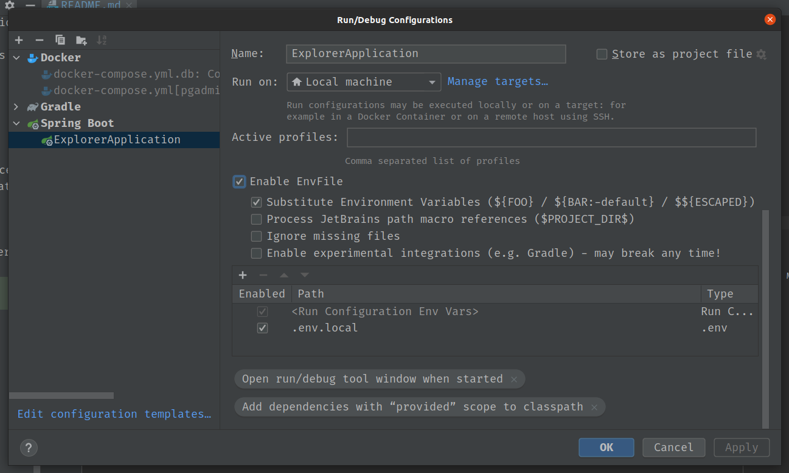

# Explorer
API Java - Desafio da elo7

## Tecnologias
Java 11

Gradle

Postgres

H2

## Rodar local
**Criar um .env e adicionar as configurações encontradas no arquivo .env.example na raíz do projeto**

Configurar o apontamento das variáveis do .env nas IDEs _JetBrains_

Levantar o serviço **db** do arquivo _docker-compose.yml_

Configurar o Docker para usar env file**(adicionar plugin Envfile)**

