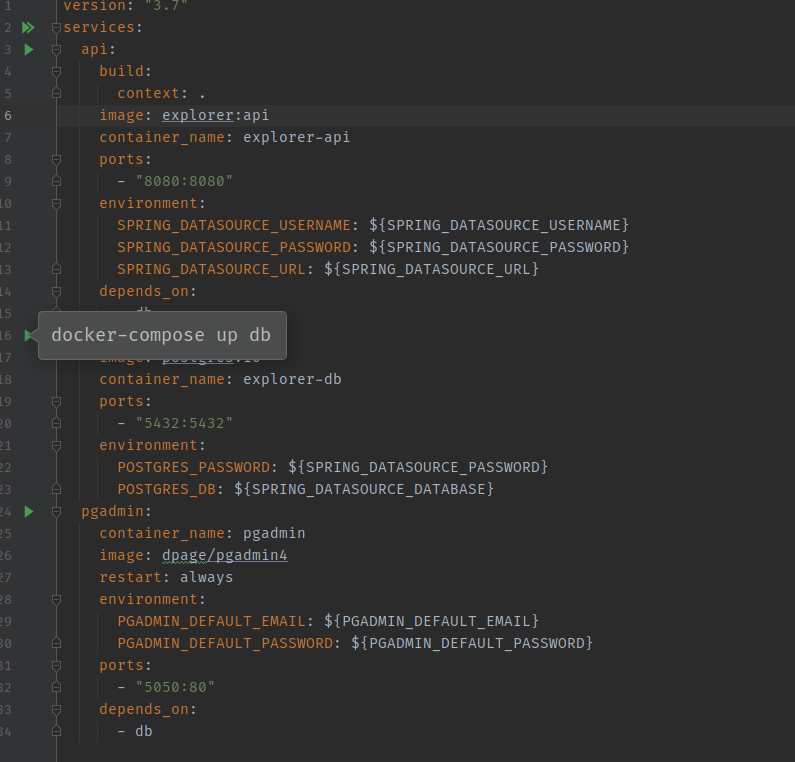

# Explorer
API Java - Desafio da elo7

## Tecnologias
Java 11

Gradle

Postgres

H2

## Rodar
Criar um .env e adicionar as configurações encontradas no arquivo .env.example na raíz do projeto

Para configurar o apontamento das variáveis do .env nas IDEs JetBrains

